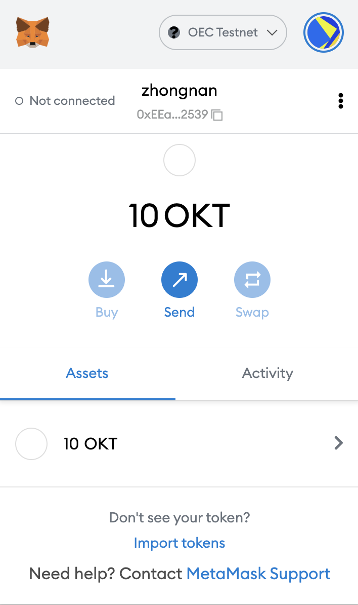
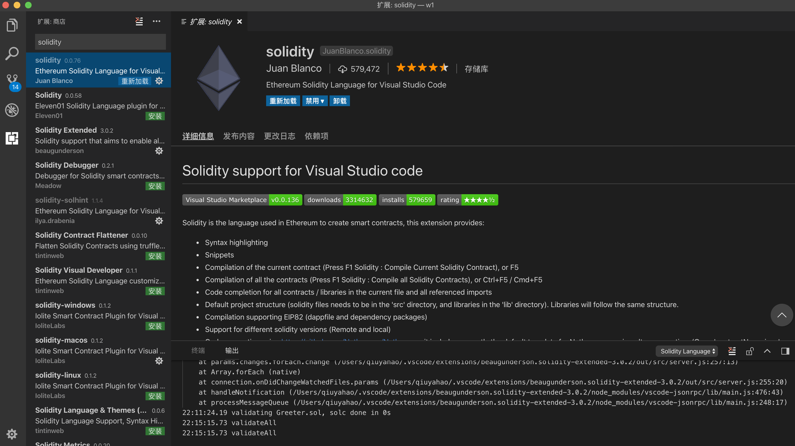

# MetaMask插件

# MetaMask发起一笔交易
[https://www.oklink.com/zh-cn/oec-test/tx/0x88cae438ce4446a1248bbf3f642e4455c8182acdb0cdfb82e7a9488bc0d68ca7](https://www.oklink.com/zh-cn/oec-test/tx/0x88cae438ce4446a1248bbf3f642e4455c8182acdb0cdfb82e7a9488bc0d68ca7)

# 使用remix部署一个合约
[https://www.oklink.com/zh-cn/oec-test/tx/0x7cca0469d46e4dab79368558419d4edfbda8ed6ed6ab183a164bc437fb296bd6](https://www.oklink.com/zh-cn/oec-test/tx/0x7cca0469d46e4dab79368558419d4edfbda8ed6ed6ab183a164bc437fb296bd6)

# vscode安装插件

# 使用hardhat部署一个合约
[https://www.oklink.com/zh-cn/oec-test/tx/0x119CBE45D5E19C47EDB281F445E5A81E2A15AE27E17D615255A64ADFC2841F39](https://www.oklink.com/zh-cn/oec-test/tx/0x119CBE45D5E19C47EDB281F445E5A81E2A15AE27E17D615255A64ADFC2841F39)